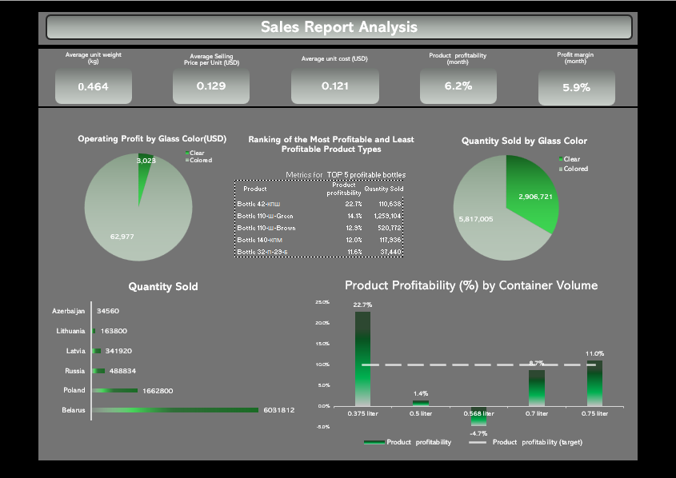
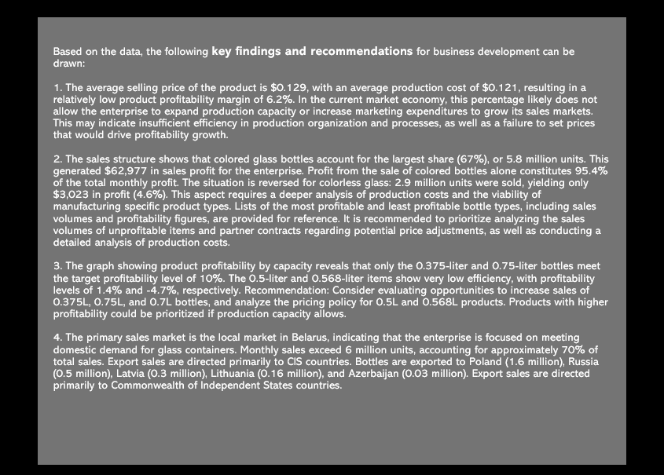

# Sales Performance Dashboard

## Project Overview

This project presents an sales performance dashboard developed in Microsoft Excel to analyze production efficiency, product profitability, sales distribution, and market performance.

The dashboard transforms raw operational data into visual business insights that support strategic decision-making.

---

## Business Objective

The objective of this project is to provide management with an interactive dashboard that helps:

- monitor key business KPIs;
- evaluate product profitability;
- identify the most profitable products;
- analyze sales distribution by market;
- compare production profitability across product categories;
- support pricing and production decisions.

---

## Tools

- Microsoft Excel
- Pivot Tables
- Pivot Charts
- Dashboard Design
- KPI Reporting
- Conditional Formatting
- Data Visualization

---

## Dashboard Features

The dashboard includes:

- Sales KPIs
- Average Selling Price
- Average Unit Cost
- Product Profitability
- Profit Margin
- Product Ranking
- Sales by Country
- Sales by Glass Color
- Product Profitability by Container Volume

---

## Dashboard Preview

### Dashboard Overview



---

### Business Findings & Recommendations



---

## Business Insights

The dashboard revealed several important business insights:

- Colored glass products generate the majority of operating profit.
- Only selected bottle volumes meet the target profitability level.
- Domestic sales account for the largest share of total sales volume.
- Product profitability varies significantly across product categories.
- Pricing strategy should be reviewed for products with low profitability.

---

## Repository Structure

```text
sales-performance-dashboard/
│
├── dashboard/
│   └── Sales_Analysis_DashboardExcel_final.xlsx
│
├── images/
│   ├── dashboard_overview.png
│   └── business_recommendations.png
│
└── README.md
```

---

## Skills Demonstrated

- Dashboard Design
- KPI Reporting
- Business Analysis
- Financial Analysis
- Data Visualization
- Microsoft Excel
- Pivot Tables
- Business Decision Support

---

## Author

**Viktoryia Vashkevich**

Business & Financial Analyst transitioning into Data Analytics

📍 Massachusetts, USA

LinkedIn:
https://www.linkedin.com/in/viktoryia-vashkevich-147702261/
